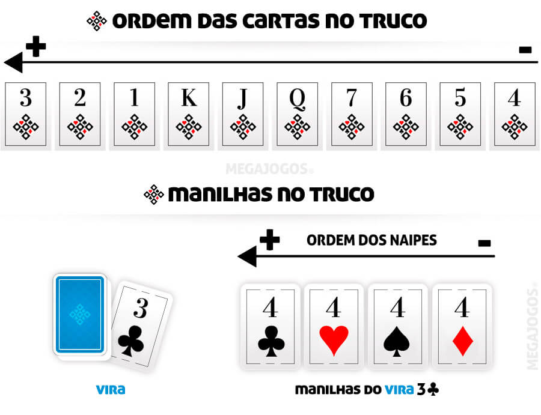

# Truco - Simulador de Torneio

**Projeto 2 do curso MC102 - Programação de Computadores**

Um simulador completo de torneio de Truco (jogo de cartas brasileiro) com interface gráfica e vários tipos de jogadores com estratégias diferentes.

## 📋 O que é o Projeto?

Este projeto implementa um **simulador de torneio de Truco** onde duplas de jogadores de IA competem em um sistema "todos contra todos". O projeto inclui:

- **Diferentes estratégias de jogadores**: desde jogadores aleatórios até jogadores com estratégias sofisticadas
- **Sistema de pontuação**: rastreamento de vitórias em jogos individuais e confrontos completos
- **Interface gráfica**: visualização animada das partidas usando Pygame
- **Histórico de jogadas**: registro completo de cada ação durante o jogo

## 🎮 Como Funciona?

### Estrutura do Jogo

1. **Mão (Round)**: Uma rodada individual com 3 cartas para cada jogador
2. **Jogo**: Série de mãos até que uma dupla atinja 12 pontos
3. **Confronto (Match)**: Série de jogos entre duas duplas
4. **Torneio**: Sistema "todos contra todos" onde todas as duplas competem entre si

#### Dinâmica do Truco

* **Vira e Manilhas**: Após distribuir as cartas, uma carta é virada na mesa (*vira*). As cartas imediatamente acima dela na sequência se tornam as **manilhas**, as cartas mais fortes da rodada.
  Exemplo: se o vira for **7**, os **Q** viram manilhas.

* **Pedido de Truco**: Durante a mão, uma dupla pode pedir **truco** para aumentar o valor da rodada. A pontuação pode evoluir de **1 → 3 → 6 → 9 → 12 pontos**, conforme os aumentos aceitos.

* **Respostas ao Truco**: Ao receber um pedido, a dupla adversária pode:

  * **Correr** → desistir da mão e ceder os pontos atuais;
  * **Aceitar** → continuar jogando com a nova pontuação;
  * **Aumentar** → pedir um novo aumento de aposta (*seis*, *nove* ou *doze*).

* **Cartas Encobertas**: Um jogador pode jogar uma carta virada para baixo (*encoberta*). Essa carta normalmente não disputa a rodada, mas pode ser usada como estratégia para esconder informação ou confundir os adversários.

* **Vitória da Mão**: A dupla que vencer **duas das três rodadas** ganha a mão e soma os pontos apostados.

---
#### Exemplo de uma Mão de Truco 



#### Situação Inicial

O *vira* é **3♣**.
Pela regra mostrada na imagem, as **manilhas** são os **4**.

Ordem das manilhas (da maior para a menor):

1. **4♦**
2. **4♠**
3. **4♥**
4. **4♣**

#### Jogadores

* **Dupla 1**: Lucas e Marina
* **Dupla 2**: Pedro e Sofia

---

#### Primeira Rodada

**Cartas jogadas**

* Lucas joga **Q♠**
* Pedro joga **K♦**
* Marina joga **2♣**
* Sofia joga **7♥**

✅ **Marina vence** com o **2♣**, já que o 2 é mais forte que K, Q e 7 na ordem do truco.

---

#### Segunda Rodada

Pedro olha para Sofia e grita:

> **“TRUCO!”**

A mão agora vale **3 pontos**.

Lucas responde:

> **“ACEITO!”**

**Cartas jogadas**

* Pedro joga **4♥** *(manilha)*
* Lucas joga **3♦**
* Sofia joga carta **encoberta** 🂠
* Marina joga **A♠**

✅ **Pedro vence** com a manilha **4♥**.

Agora está **1 rodada para cada dupla**.

---

#### Terceira Rodada

Antes de jogar, Marina aumenta:

> **“SEIS!”**

Agora a mão vale **6 pontos**.

Sofia responde:

> **“ACEITO!”**

**Cartas jogadas**

* Lucas joga **3♠**
* Pedro joga **2♦**
* Marina joga **4♠** *(manilha)*
* Sofia joga **A♦**

✅ **Marina vence** com a manilha **4♠**.

#### Resultado Final

🏆 **Lucas e Marina vencem a mão**
⭐ **Pontos ganhos: 6**

---

### Tipos de Jogadores

1. **DummyPlayer**: Joga aleatoriamente, estratégia básica
2. **GreedyPlayer**: Joga sempre a melhor carta, pede truco com manilhas
3. **ReverseGreedyPlayer**: Guarda boas cartas para o final
4. **Dupla do Estudante**: Seus próprios jogadores (implementados em `student_players.py`)


## 🚀 Como Executar

### Requisitos
- Python3 3.7+
- Pygame (para interface gráfica)

### Instalação de Dependências

```bash
# Criar um ambiente virtual
python3 -m venv venv
source venv/bin/activate

# Instalar dependências
pip install pygame
```

### Executar o Torneio

**Modo gráfico (padrão):**
```bash
python3 main.py
```

**Com número de jogos customizado:**
```bash
python3 main.py --num-matches 500
```

**Com velocidade customizada:**
```bash
python3 main.py --speed 2  # 2x mais rápido
```

**Modo terminal (sem gráficos):**
```bash
python3 main.py --speed 0
```

**Combinações de argumentos:**
```bash
python3 main.py -n 100 -s 0.5  # 100 jogos, 50% velocidade
```

### Argumentos da Linha de Comando

- `-n, --num-matches`: Número de mãos em uma partida entre duas duplas (padrão: 1000)
- `-s, --speed`: Velocidade de exibição das jogadas (padrão: 1)
  - `0`: Modo terminal (sem visualização gráfica)
  - `1`: Velocidade normal
  - `> 1`: Mais rápido
  - `< 1`: Mais lento

## 🎯 Sua Tarefa

Implemente a sua dupla dentro do arquivo `student_players.py`.

Requisitos mínimos:

 - Crie uma classe que estenda `Player` e implemente ao menos os métodos `play(self, top_card, play_hist, score_hist)` e `respond(self, top_card, play_hist, score_hist)`.
- Forneça as funções `pair_name()` e `create_pair()` que retornem o nome da dupla e uma tupla com duas instâncias dos seus jogadores, respectivamente.
- Não modifique as assinaturas públicas exigidas pelo simulador.

Modelo mínimo (exemplo):

```python
from basic_players import Player

class NonePlayer(Player):
  def __init__(self):
    super().__init__(0, "Ninguém")

  def play(self, top_card, play_hist, score_hist):
    """Retorna uma tupla (decisão, carta):
    decisão: 0 = encoberta, 1 = normal, 2 = pedir truco
    carta: a carta a ser jogada (ou None)
    Parâmetros:
    - `top_card` / `vira`: a carta virada na mesa
    - `play_hist`: histórico de jogadas (lista de mãos, cada mão é lista de jogadas)
    - `score_hist`: histórico de placares correspondendo a cada mão
    """
    if self._cards:
      return 1, self._cards[0]
    return 1, None

  def respond(self, top_card, play_hist, score_hist):
    """Responde a pedidos de truco:
    retorna 0 (correr), 1 (aceitar) ou 2 (aumentar)
    """
    return 0

def pair_name():
  return "algum nome"

def create_pair():
  return (NonePlayer(), NonePlayer())
```


## Critérios de Avaliação

Os jogadores serão avaliados segundo os seguintes critérios:

- **Funcionamento:** o agente joga seguindo as regras do simulador e não causa erros em partidas completas.
- **Conformidade com a API:** não alterar assinaturas; implementar `play`, `respond`, `pair_name` e `create_pair` conforme esperado.
- **Robustez:** o código deve tratar casos limites (mãos vazias, respostas inválidas) e não deve lançar exceções durante uma simulação padrão.
- **Comportamento esperado:** a estratégia deve ser coerente e justificar-se por meio do histórico (`play_hist`).
- **Qualidade do código e documentação:** clareza, nomes significativos e comentários mínimos explicando a estratégia.
- **Execução:** o simulador deve rodar com sua dupla no modo terminal (`--speed 0`) e no modo gráfico sem alterações adicionais ao resto do código.

## Regras sobre bibliotecas externas

Não é permitido o uso de bibliotecas externas além das já incluídas no projeto. Ou seja, você deve usar apenas a biblioteca padrão do Python e as dependências já fornecidas (por exemplo, `pygame` para a interface gráfica). O uso de outras dependências externas não será aceito e pode resultar em desqualificação ou perda de pontos.

Não modifique outros arquivos do projeto para integrar dependências externas; tudo deve estar contido em `student_players.py` e usar apenas os recursos já disponíveis no repositório.


## 💡 Dicas para Melhorar Sua Estratégia

1. **Analise o histórico**: Use `play_hist` para ver padrões dos jogos anteriores
2. **Gerencie risco**: Nem sempre pedir truco é bom
3. **Observe parceiros**: Veja o que seu parceiro já jogou
4. **Estratégia adaptativa**: Ajuste sua tática baseado no placar
5. **Cartas encobertas**: Use para criar incerteza

**Divirta-se e bom jogo! 🎮**
